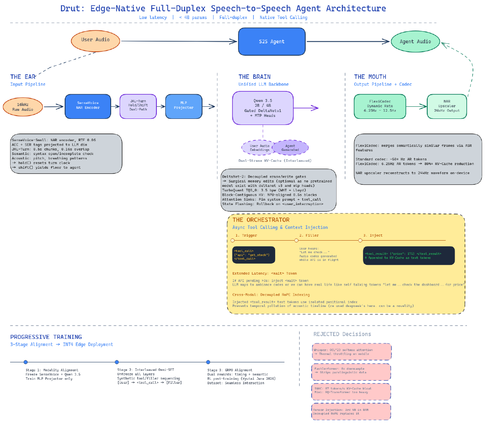

## The Question

What would a speech model look like if it ran entirely on your phone?

Not a cloud API with a thin client. The model lives on device, listens continuously, and responds in under 150 milliseconds. It calls tools, handles interruptions mid-sentence, and works across languages.

Most speech AI is a pipeline: speech to text, text to a language model, text back to speech. Each step adds latency. The model cannot hear your tone, your hesitation, or the fact that you paused to think.

End-to-end models like Moshi fix some of this, but they are too large for mobile hardware. They eat through VRAM and thermal throttle on NPUs.

We want something smaller. Stricter. More resourceful.

## Current Design

**Audio encoder:** SenseVoice-Small. Non-autoregressive. Real-time factor of 0.06 on a mobile CPU. Classifies acoustic events and detects emotion natively.

**Turn-taking:** JAL-Turn. Processes audio in 500ms windows with overlap. Fuses syntactic completeness and acoustic cues into a hold-or-shift decision. If you pause to think, it holds. If you're done, it shifts.

**Language model:** Qwen 3.5 at 2B or 4B parameters with DeltaNet v1 layers. Linear recurrence instead of full attention. Infinite context without quadratic memory growth. Multi-Token Prediction heads for faster decoding.

**Speech output:** FlexiCodec at 6.25–8.3 Hz. The LLM predicts 6–8 structural tokens per second. A non-autoregressive upscaler expands these into 24 kHz audio.

**Tool calling:** When the model calls a tool, it emits a special token. A C++ orchestrator fires the API request and keeps the model running. The model doesn't sit idle — it generates filler audio. "Let me check on that." If the API takes longer, it transitions to ambient room tone. The user never hears dead silence.

## What We Think Will Work

Four optimizations to stay within 2GB:

- Block contiguous KV allocation aligned to 500ms audio chunks
- TurboQuant: Walsh-Hadamard transform + 3-bit Lloyd-Max codebook (~3.5 bits per parameter)
- Attention sinks pinning system prompts and tool call tokens in recurrent memory
- State flushing: on interruption, recurrent state rolls back to a snapshot before the model started speaking

Training plan has three stages:

1. Freeze encoder and LLM. Train projector using Mozilla Common Voice.
2. Unfreeze everything. Train on synthetic interleaved data: audio, tool call, filler, wait, silence, tool result, answer.
3. GRPO reinforcement learning with a dual reward: timing reward + semantic judge.

## What We Don't Know Yet

Whether the 2GB budget is actually achievable with acceptable quality. Whether FlexiCodec preserves prosody well enough across languages. Whether the "muttering trick" feels natural or just annoying. Whether state flushing recovers cleanly from interruptions or introduces subtle bugs.

Most of this is still on paper. The first prototype is in progress.

## Status

| | |
|---|---|
| **State** | Prototype in progress |
| **Confidence** | Low. Everything is theoretical until the first benchmark. |
| **Last updated** | June 2026 |
| **Known blockers** | No training data pipeline yet. Hardware targets unconfirmed. |
| **Open question** | Can a 2B parameter model sound natural while calling tools and handling interruptions? |
| **Next experiment** | End-to-end latency benchmark on a Snapdragon NPU |

**What would you build if latency didn't matter?**
